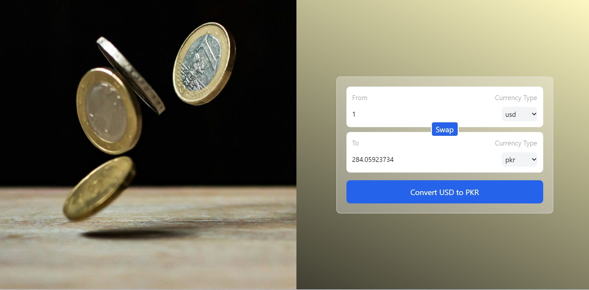

# Currency Converter App

This is a currency converter application that supports up to 250 different currencies. It uses a real-time API to fetch and display the most current currency values.

## Features

- Supports up to 250 different currencies
- Real-time currency conversion
- Easy to use interface

## How to Use

1. Select the currency you want to convert from.
2. Select the currency you want to convert to.
3. Enter the amount you want to convert.
4. The application will display the converted amount in real-time.

## API Used

This application uses the [Currency Converter API](https://www.currencyconverterapi.com/) for real-time currency conversion.

## Screenshot

## Features

- All components are designed to be independent and reusable.
- Real Time Currency Values of more than 200 pairs 
- Swap values with each other

## Technologies Used

- [React](https://reactjs.org/) + [Vite](https://vitejs.dev/)
- [Tailwind CSS](https://tailwindcss.com/)
- [Real Time Currency Api](https://exchangeratesapi.io/)